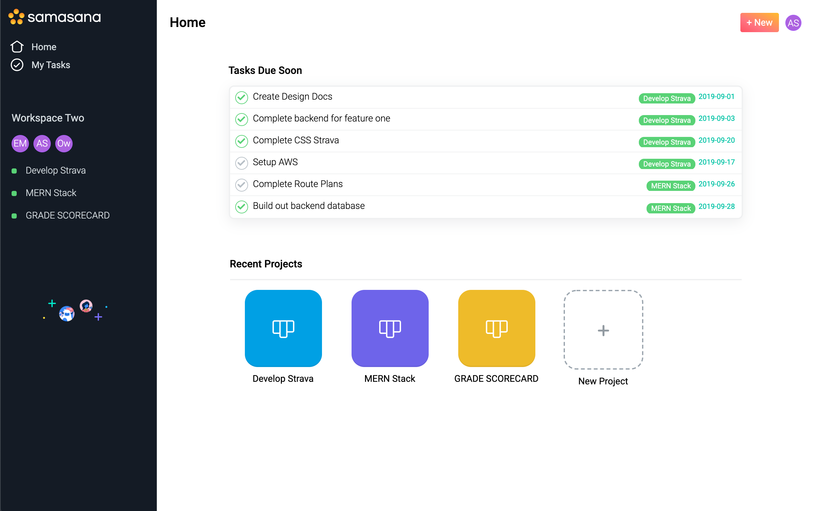
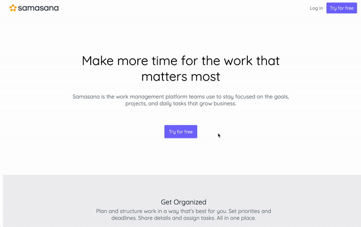
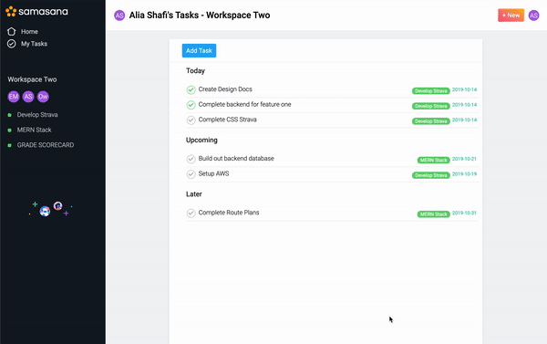
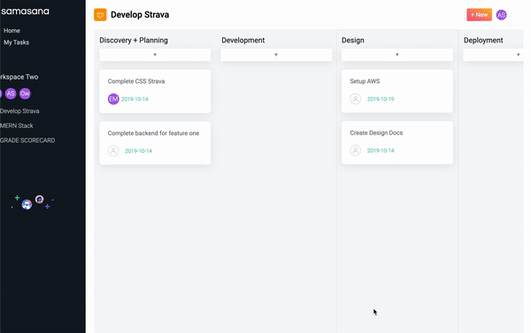

# SAMASANA

Samasana, a full stack clone of Asana, is an easy-to-use task and project management software that allows users to create, update, and order tasks within a simple list or a project Kanban board.

_Note: Samasana is a sanskrit word with the meaning of "act of putting together, combination, composition." The picking of another sanskrit name is a salute to Asana. At the same time, it aptly captures how, through this project, I was able to put together skills learned during the four instense months of full stack bootcamp curriculum and produce something practical and pleasing to use._

[Click here for live demo](https://samasana.herokuapp.com)

 

 

## Technologies
* Backend: Rails/ActiveRecord/PostgreSQL
* Frontend: React/Redux/CSS/SCSS
* [react-beautiful-dnd](https://github.com/atlassian/react-beautiful-dnd)
* [styled-components](https://www.styled-components.com/) (limited use for for components using react-beautiful-dnd)

## Key Features
* Auto creation of workspace upon new user signup
     
    
     
* Ability manage all tasks assigned to a user on My Tasks page 
    * Ability to create/update/delete tasks
    * Ability to see tasks organized by closeness of due date
    * Ability to drag the tasks within the due date grouping and reorder them
     
    
     
* Ability to manage team tasks on project kanban board (full CRUD for projects and tasks)
    * Ability to create/update/delete projects and tasks
    * Ability to drag tasks and kanban board columns around to reorder
     
    

## Future Enhancements
* User profile settings 
* Workspace settings
* Tags for tasks
* Subtasks
* Tasks search
* Member invitation
 
